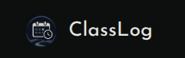

# ClassLog

A responsive Flask app for tracking attendance across a semester, because doing the
math on "how many classes can I actually skip" in your head is annoying
and you will get it wrong in your own favor.

Built around one specific problem: attendance requirements are usually a
single number (75%, 80%, whatever your university mandates), but nobody
tells you what that means in practice on any given Tuesday. This does.

## What it actually does

- **Semesters.** Everything lives inside a semester — a start date, an
  end date, and a name. Delete one and its subjects/attendance go with it
  (with a confirmation first, because that's not an undo-able mistake you
  want to make from a hover-slip).
- **Subjects.** Each subject belongs to a semester and carries its own
  minimum attendance requirement, because not every class enforces the
  same threshold.
- **Marking attendance.** Pick a subject, the date, the start/end time,
  hit Present or Absent. No middle state where you save a draft and come
  back to it — you're recording something that already happened.
- **The dashboard.** Shows every subject as a donut chart of your current
  attendance, colored against how close you are to falling below the
  minimum (not just present/absent as a flat percentage). Green means
  you've got real room. White means you're right around the line. Yellow
  and red mean you should probably stop skipping that 9am. Under each
  donut, it tells you outright how many more classes you can miss (or
  how many you need to attend to climb back over the line if you're
  already under).
- **History.** Every recorded class, grouped by subject, with the day it
  happened, the time, and whether you showed up — plus edit/delete on
  each row for when you mis-tap Absent on the one day you were actually
  there.

## Stack

- Server-rendered Flask + Jinja2

- Plain CSS

- Few vanilla JS snippets sprinkled around

## Screenshots

#### Dashboard

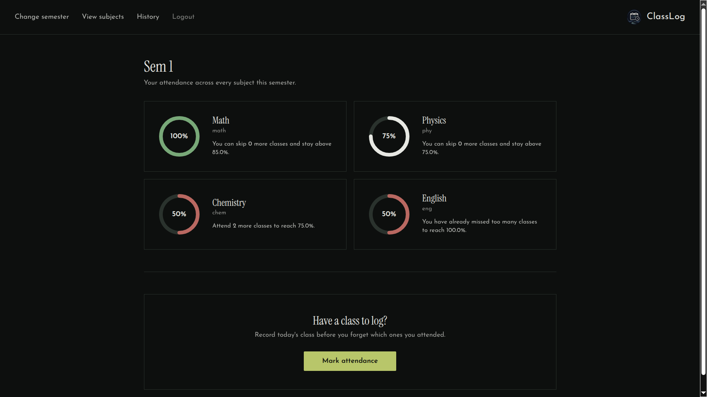

#### Semester view

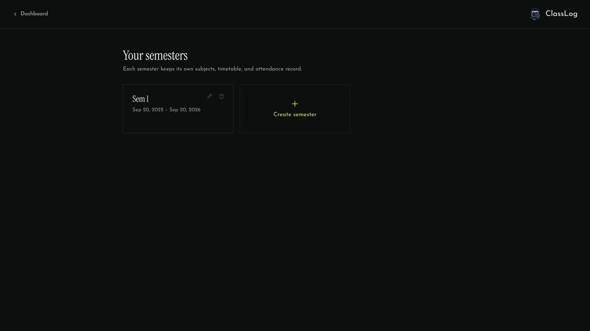

#### Create semester page

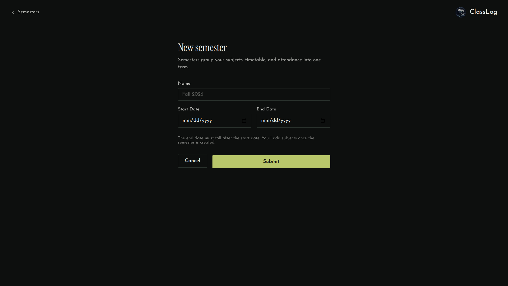

#### Edit Semester page

#### Subject view

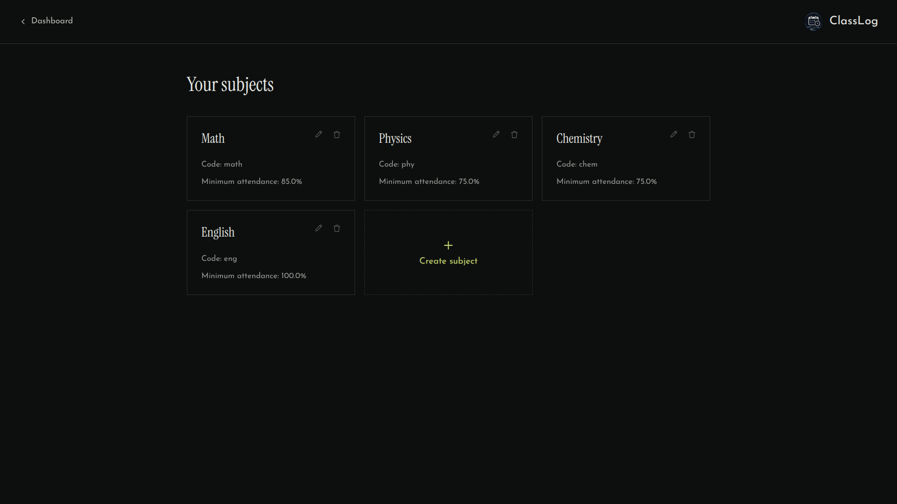

#### Create subject view

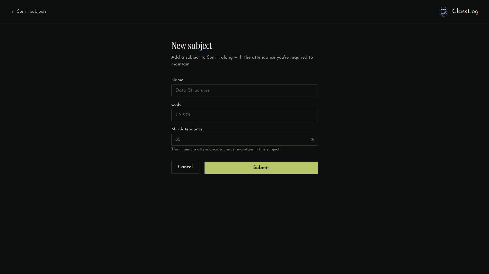

#### Edit subject view

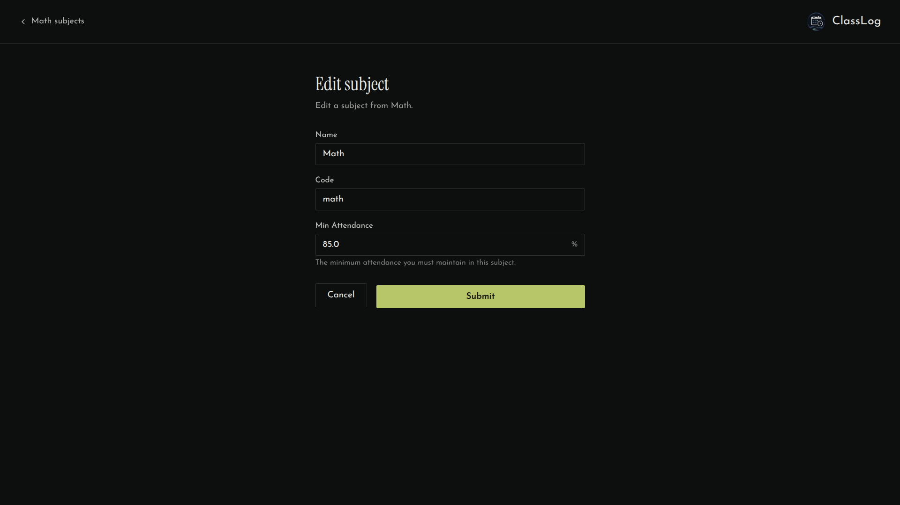

#### Attendance history

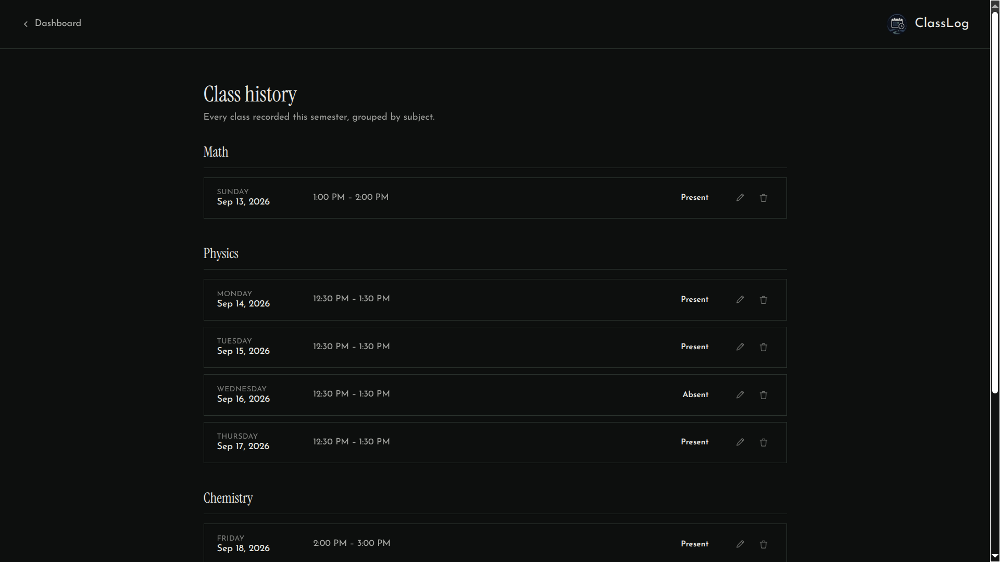

#### Edit attendance page

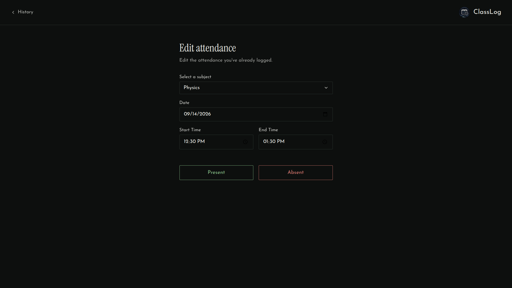

#### Log attendance page

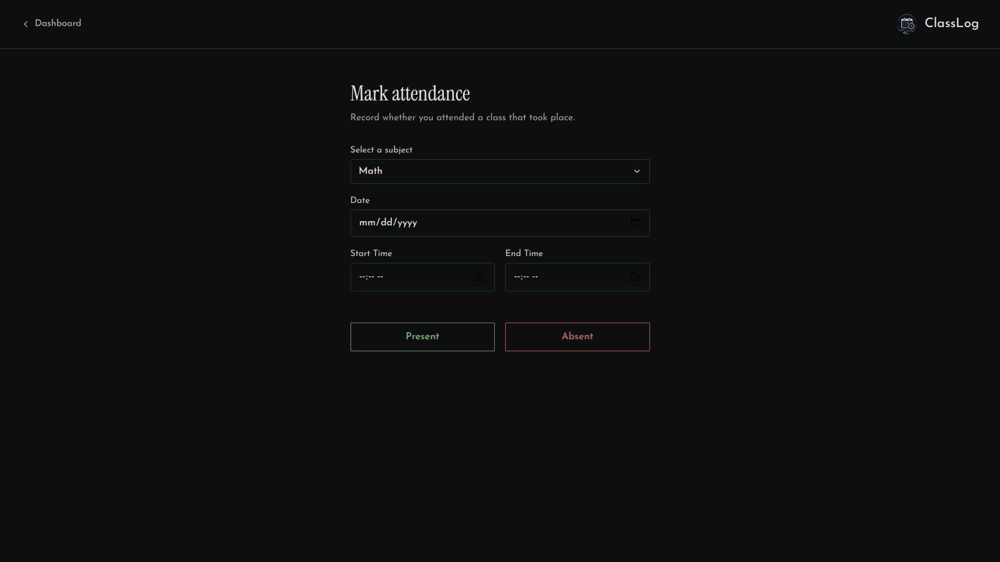

#### Sign-up page

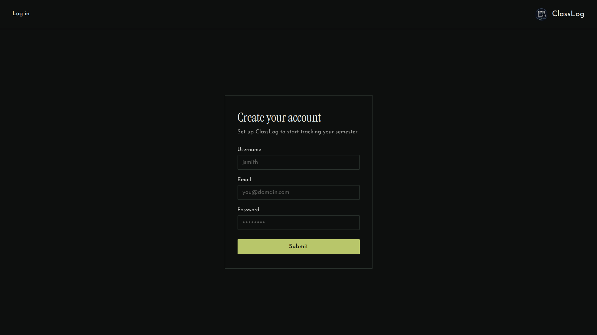

#### Log-in page

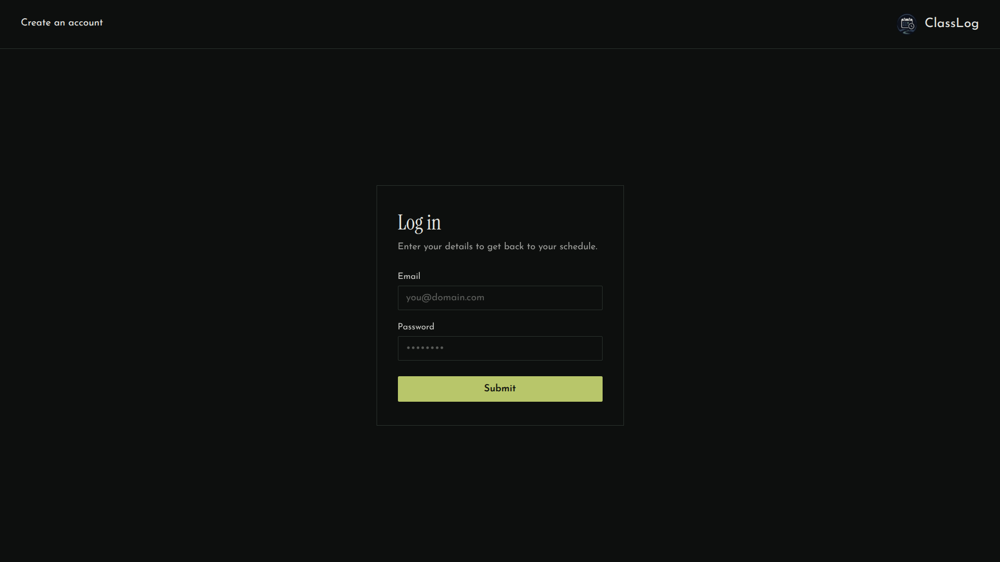

#### Verification code page

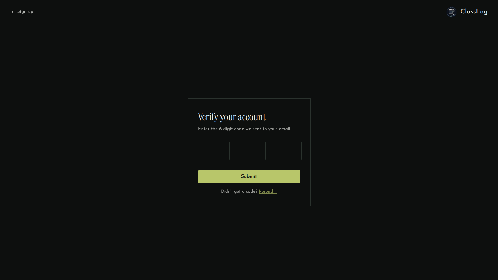

## Todo

- [ ] Create a profile page to view and edit profile details

- [x] Implement verification checks for emails using Flask-Mail

- [ ] Integrate OAuth authentication

- [ ] Create a calendar-like view to look at the weekly timetable

- [ ] Add feature to export attendance history (to CSV or PDF)

- [ ] Add feature to bulk-mark attendance
